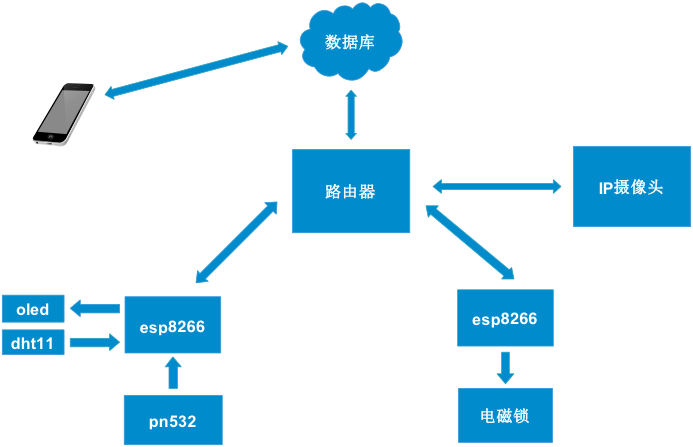

# The-Door-Access-control
门禁系统 基于ESP8266

> 本文设计一款廉价安全操作简单且功能齐全的门禁系统。此项目是可以利用手机远程监控和管理的门禁系统，通过esp8266的WiFi功能控制，IP摄像头监控，射频模块刷卡，温湿度传感器采集信息，OLED显示温湿度等。利用openwrt路由器将收集的数据上传到云端服务器， 再通过baas技术以及安卓开发技术，手机客户端即可访问云端服务器，管理监控门禁系统。               ——摘自我的毕业论文

